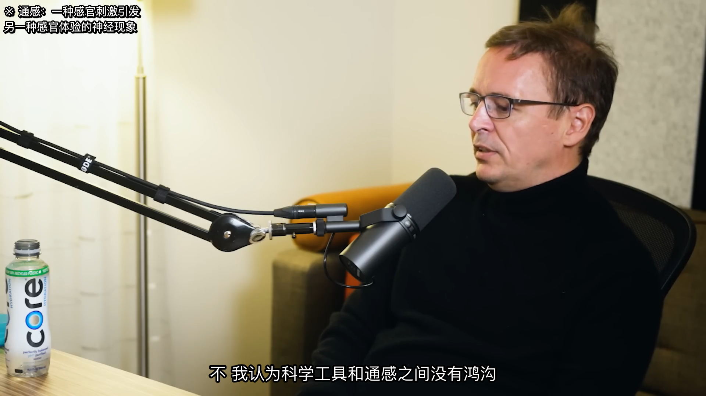
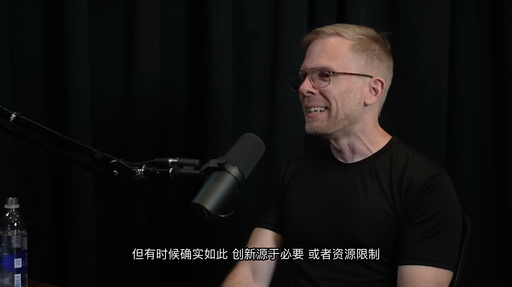
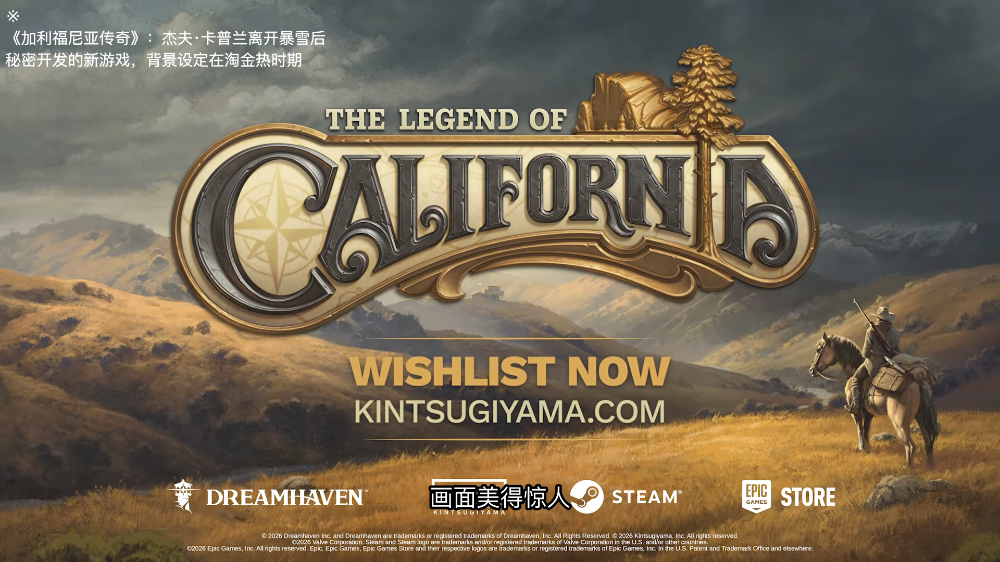

# Light

视频/音频 → 高质量字幕全自动流水线。一条命令完成听写、矫正、断句、翻译与导出；也可通过 Web 界面提交链接、实时查看进度并播放。

```
输入 → ASR → 矫正 → 标点 → 断句 → compose+split(共享) → 翻译(可选) → 字幕格式化 → 导出(SRT/VTT/ASS/JSON) → QC
```

## 功能与特性

### 字幕生成

- **一键出字幕**：支持本地视频/音频，Web 端支持 YouTube、B站、X 等链接（yt-dlp）
- **词级时间轴**：WhisperX（默认）或 whisper.cpp + 对齐，为后续断句与 QC 提供精确时间戳
- **听写后处理**：LLM 转录矫正、标点恢复，减少 ASR 常见错误
- **智能断句**：按语义与语言规则切分（英语 Netflix 规范、中文 CPS/行宽约束），而非硬切时长
- **可读性优化**：自动控制每行字数、阅读速度（CPS）、最短/最长显示时长、词边界对齐

### 翻译

- **多语言翻译**：指定 `--target-lang` 生成译文字幕（如英 → 中）
- **双语输出**：同时导出源语 + 译语 SRT/VTT，或合并为双语 ASS
- **上下文感知**：自动提取术语表与内容概要，翻译更一致；支持自定义 glossary
- **质量闭环**（可选）：LLM 评分 + 低分句重译（`--evaluate`）
- **技术注解副字幕**（可选）：为专业术语生成 ASS 副字幕，播放器可单独加载

### 质量保障

- **独立 QC 引擎**：对任意 SRT/VTT 运行规则检查（行数、CPS、时长、重叠、未译文本等）
- **时间轴对齐 QC**：携带 `transcript.json` 可检查字幕与词级时间轴的偏差
- **HTML 报告**：一键生成可读 QC 报告，定位问题 cue

### 使用方式

- **CLI**：适合本地批处理、脚本集成与精细参数控制
- **Web 应用**：视频库、URL 提交、SSE 进度、在线播放与字幕切换；长视频自动按静音点切片处理
- **断点续跑**：任务中断或失败后，从任意步骤继续，无需重跑 ASR（~90s）或翻译

### 导出格式

| 格式 | 说明 |
|---|---|
| SRT / VTT | 通用软字幕，兼容主流播放器 |
| ASS | 双语样式、注解副字幕 |
| JSON | `cues.json`、`transcript.json`，便于二次开发或 QC |

## 效果预览

> 示例资源位于 `resources/` 目录（图片、小视频）。

| 来源 | 截图 |
|---|---|
| Joscha Bach — Life, Intelligence & AI |  |
| John Carmack — Lex Fridman #309 |  |
| Jeff Kaplan — World of Warcraft & Overwatch |  |

## 安装

```bash
# Python ≥ 3.12, uv 包管理器
uv sync
```

## 架构

```
packages/
├── light-models/        共享数据契约（Word, Segment, SubtitleCue, is_cjk…）
├── light-subtitle/      ASR → 翻译 → 字幕流水线
│   ├── pipeline/        ASR → correct → punct → segment → translate → subtitle → export
│   ├── step_registry.py 声明式步骤注册表（StepId + run/hydrate/progress）
│   ├── step_plan.py     运行时 plan 构建与 resume 解析
│   └── language/        语言处理（英语/CJK 断句、标点、显示约定）
├── light-qc/            独立 QC 引擎（规则 + LLM）
├── light-regression/    回归测试工具
├── light-backend/       FastAPI Web 后端（routers/ + services/）
└── light-frontend/      React + Vite SPA（pages/ + components/）
```

| 包 | 职责 | 依赖 |
|---|---|---|
| `light-models` | dataclass / 时间码 / CJK 检测 | 无 |
| `light-subtitle` | 音频 → ASR → 矫正 → 断句 → 翻译 → 字幕 → 导出 | light-models |
| `light-qc` | 解析字幕文件 → 规则引擎 → LLM QC → 报告 | light-models |
| `light-regression` | 固定音频 → 完整管线 + QC → 逐次对比 → Dashboard | light-models, light-qc |
| `light-backend` | FastAPI + SQLite → yt-dlp 下载 → 管线调度 → SSE → 视频流 | light-models, light-subtitle |
| `light-frontend` | React + Video.js → 视频库 → URL 提交 → 进度面板 → 播放 | — |

`light-qc` 可独立使用，直接对任何字幕文件运行，不依赖流水线。

## CLI

### light-subtitle

```bash
# 同语言字幕（源语）
uv run light-subtitle -i input.mp4

# 翻译字幕
uv run light-subtitle -i input.mp4 --target-lang zh

# 双语字幕
uv run light-subtitle -i input.mp4 --target-lang zh --bilingual

# ASR 引擎选择（默认 whisperx）
uv run light-subtitle -i input.mp4 --asr whisper-cpp

# 说话人分离 + LLM 注释副字幕
uv run light-subtitle -i input.mp4 --target-lang zh --diarize --annotate

# 通过 URL 下载并生成字幕
uv run light-subtitle --url https://www.youtube.com/watch?v=VIDEO_ID --target-lang zh

# URL 输入 + 评估循环
uv run light-subtitle --url https://youtu.be/VIDEO_ID --target-lang zh --evaluate
```

`--url` 支持所有 yt-dlp 兼容平台：YouTube、Bilibili、X/Twitter、YouTube Music 等。下载的视频按标题自动命名，输出到 `output/<slug>/`。长视频（时长超过 `--split-threshold`，默认 2700 秒 = 45 分钟）自动按静音点切片、逐段处理、合并输出。用 `--split-threshold` 调整切分阈值（调低可强制对较短视频切分，用于测试跨段行为）。

> **注意**：`--input` 和 `--url` 互斥，一次只能指定一个。

**断点续跑**（依赖 `output/pipeline_run.json` 与各步骤 artifact）：

```bash
# 从失败/中断的步骤继续（读取 pipeline_run.json）
uv run light-subtitle -i input.mp4 --target-lang zh --resume

# 从指定步骤开始（跳过此前步骤，从 artifact 灌状态）
uv run light-subtitle -i input.mp4 --resume-from correct
uv run light-subtitle -i input.mp4 --target-lang zh --resume-from translate.compose
uv run light-subtitle -i input.mp4 --target-lang zh --resume-from subtitle
```

常用 step ID（完整列表因 `--target-lang` / `--asr` / `--diarize` 等配置而异，见 `--help`）：

| Step ID | 说明 |
|---|---|
| `asr.extract` / `asr.transcribe` / `asr.align` / `asr.diarize` | ASR 子步骤 |
| `correct` / `punct` / `segment` | 矫正 → 标点 → 断句 |
| `context` | 翻译上下文（术语表 + 概要） |
| `translate.compose` … `translate.save` | 翻译子步骤 |
| `annotate` / `subtitle` / `export` | 注解 → 格式化 → 导出 |

**开发迭代**（已有 artifact 时跳过耗时的 ASR / 翻译 LLM 调用）：

```bash
# 跳过 ASR（需已有 transcript.json）
uv run light-subtitle -i input.mp4 --resume-from correct

# 跳过 ASR + 翻译（需已有 translations/raw.json + transcript.json）
uv run light-subtitle -i input.mp4 --target-lang zh --resume-from subtitle
```

完整参数见 `uv run light-subtitle --help`。`--font` 控制 ASS 导出字体（默认 `PingFang SC`，按系统字体链回退）；`pack` 子命令同样支持 `--font`。

#### pack — 烧录字幕到视频

`pack` 是 `light-subtitle` 的子命令，把字幕硬烧进视频生成自包含 MP4（`{slug}_pack.mp4`）。自动识别主字幕：优先 `bilingual.ass`（双语，中上英下），回退 `zh.srt`（单语中文）。可选叠加 `annotations.ass` 副图层。

```bash
# 单语运行后烧中文字幕
uv run light-subtitle -i input.mp4 --target-lang zh -o output
uv run light-subtitle pack output

# 双语 + 指定字体
uv run light-subtitle -i input.mp4 --target-lang zh --bilingual --font "PingFang SC" -o output
uv run light-subtitle pack output

# 指定编码器/字体/视频（--font 对双语 ASS 与 SRT 均生效，含系统回退链）
uv run light-subtitle pack output --encoder libx264 --font "PingFang SC" --video path/to/video.mp4
```

> 需 `ffmpeg-full`（Homebrew）提供 libass 支持：`brew install ffmpeg-full`

### light-qc

```bash
# 规则引擎 + transcript 时间轴对齐
uv run light-qc -i output/en.srt --transcript output/transcript.json

# 规则引擎 + LLM QC
uv run light-qc -i output/en.srt --transcript output/transcript.json --llm

# 双语检查
uv run light-qc -i output/en.srt -i output/zh.srt --source-lang en --target-lang zh --bilingual --transcript output/transcript.json

# 输出 HTML 报告
uv run light-qc -i output/en.srt --transcript output/transcript.json -f html -o output/qc_report.html
```

完整参数见 `uv run light-qc --help`。

### light-regression

回归测试采用**固定黄金基线**比对：每个 case 在 `tests/regression/snapshots/<case>/baseline.json` 存一份黄金基线，`run` 每次都跟它比，跨人/跨机器可比；首跑（无基线）直接通过。代码改进、确认输出质量达标后用 `rebaseline` 推进基线。

```bash
# 运行回归测试（跟黄金基线比对；首跑无基线直接通过）
uv run light-regression run tests/regression/cases/yt_kYkIdXwW2AE/case.yaml

# 推进黄金基线（确认当前输出质量达标后）
uv run light-regression rebaseline tests/regression/cases/yt_kYkIdXwW2AE/case.yaml                # 重跑一次并设为新基线
uv run light-regression rebaseline tests/regression/cases/yt_kYkIdXwW2AE/case.yaml --from-run 20260619T145251  # 用已有 run 设基线（不重跑）

# 生成 Dashboard
uv run light-regression dashboard

# 对比两次运行
uv run light-regression diff tests/regression/cases/yt_kYkIdXwW2AE/case.yaml 20260615T100000 20260615T142301
```

完整参数见 `uv run light-regression --help`。

ASR 自动缓存 transcript.json（按音频内容哈希），后续运行跳过 ASR，从 ~90s 降至 <1s。

### light-backend（Web 服务）

```bash
# 启动后端（默认 http://0.0.0.0:8787）
uv run light-backend

# 自定义端口 / 数据目录
LIGHT_PORT=9000 LIGHT_DATA_DIR=./my_data uv run light-backend

# 前端开发服务器
npm --prefix packages/light-frontend run dev

# 前端生产构建
npm --prefix packages/light-frontend run build
```

环境变量：`LIGHT_PORT`（默认 8787）、`LIGHT_DATA_DIR`（默认 `./data`）、`LIGHT_COOKIES_BROWSER` / `LIGHT_COOKIES_FILE`（yt-dlp 认证）。

## Web 应用

**数据目录结构**：

```
data/
├── light.db                       # SQLite（视频索引 + 管线运行记录）
└── videos/{id}/
    ├── original.mp4               # yt-dlp 下载的视频
    ├── thumbnail.jpg              # 自动提取的缩略图
    └── chunks/                    # >45min 视频的切分片段
        ├── chunk_000.mp4
        └── out_000/               # 该片段的 subtitle 产物
            ├── zh.srt / zh.vtt
            └── transcript.json
```

**功能**：

- 视频 URL 提交（yt-dlp 兼容平台：YouTube / B站 / X 等）
- 长视频自动按静音点切片，逐段独立跑管线
- 多段自动续播，片段列表可手动切换
- 本地导入已有 output 目录
- SSE 实时进度推送
- 跨设备访问（同一局域网）

## 输出文件

```
output/
├── pipeline_run.json             管线运行状态（resume 用）
├── audio_asr.wav                 提取的音频
├── asr/
│   └── asr_whisperx.json         ASR 词级结果（引擎名随 --asr 变化）
├── {slug}.en.srt / {slug}.en.vtt   源语字幕（短视频/合并后带 slug 前缀）
├── {slug}.zh.srt / {slug}.zh.vtt   译语字幕
├── {slug}.bilingual.ass            双语 ASS（单 Dialogue 合并：ZH 行 + \N + EN 单行 fs14，按 unit_id 配对）
├── {slug}.annotations.ass          副字幕注解（--annotate）
├── cues.json                     字幕 cue 列表
├── transcript.json               标准化转录（含 word 时间戳，供 QC）
├── segment/
│   └── segment.json              语义断句单元（pause-based 原始分段）
├── compose/
│   ├── compose.json              compose+split 翻译单元（单语/双语共享，对齐用 unit_id 图）
│   └── segment_words.json        组合单元的词级时间戳（resume 重建用）
├── context/                      翻译上下文（glossary + summary）
├── translations/
│   ├── partial.json              翻译中间结果
│   ├── raw.json                  LLM 原始翻译输出
│   ├── source.json               源语对照字幕
│   └── usage.json                Token 消耗统计
└── qc_report.html                QC 报告（light-qc 生成，本地文件）
```

## 关键约束

- `output/` 已 gitignore，用于本地验证
- `data/` 已 gitignore，Web 后端运行时数据
- 回归测试快照 `tests/regression/snapshots/` **禁止删除**
- 新 QC 规则必须零误报才提交
- light-qc 建议始终携带 `--transcript` 参数，以启用完整的时间轴对齐规则
- `--resume` 读取 `output/pipeline_run.json`；`--resume-from STEP` 从指定步骤开始，需对应 artifact 已存在
- 回归测试 ASR 缓存见 light-regression；CLI 侧用 `--resume-from` 达到相同加速效果
