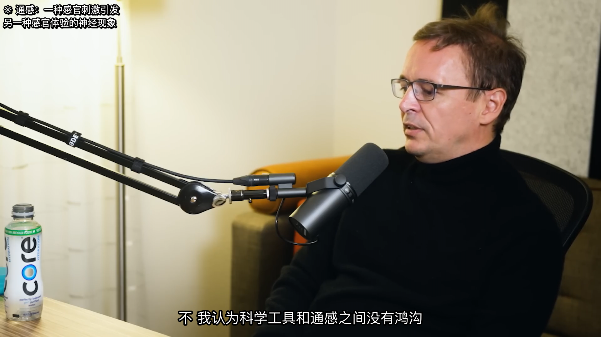
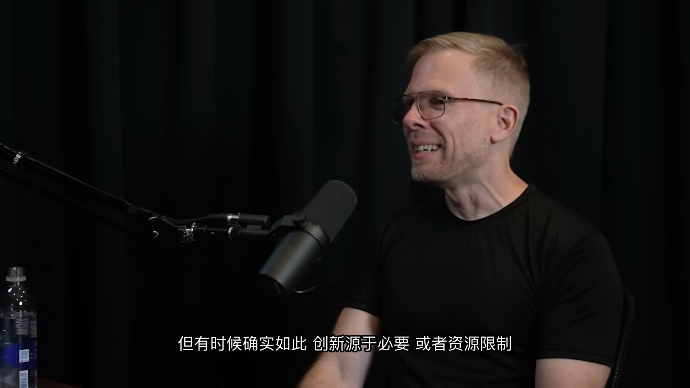

# Light

Light 对视频和音频做 ASR 听写、精修与翻译，产出两样东西：带词级时间戳的转录稿，和直接能看的成品字幕（SRT / VTT / 双语 ASS）。字幕可加载播放、烧录进视频，还能配上克隆音色的中文配音。

CLI 适合批处理与脚本集成；Web 界面用来提交链接、实时看进度、在线播放。

## 为什么是 Light

Whisper + LLM 翻译的一键字幕工具已经很多，但"能出字幕"和"能直接看的字幕"之间隔着大量工程细节。Light 的全部设计都在补这段距离：

**字幕边界是全局规划出来的，不是转录切出来的。** 多数工具直接拿 whisper segment 当字幕行，断句碎、语义断裂。Light 先按停顿与语义切出翻译单元，再让 LLM 统揽全文规划每条字幕的边界——时长、阅读节奏、说话人切换尽在视野内；双语输出共享同一份边界规划，中英逐条精确对齐，不会各断各的。

**词级时间轴全程保真。** 毫秒级词时间戳从 ASR 一路贯穿到导出：LLM 矫正后用 diff 对齐回每个词，字幕边界对齐到真实发音，调整节奏只借用空闲时间——绝不为凑指标挤压相邻字幕。

**可读性是硬约束，不是尽力而为。** 阅读速度（CPS）超标先借时间、再压缩译文，绝不拆碎语义；英文断行遵循 Netflix 语法规范（冠词不与名词分离等），中文断行基于分词，并按屏幕显示约定净化标点（逗号转全角空格、行末句号省略）。

**LLM 只做决策，不掌握生杀。** 每次 LLM 调用都有结构化输出校验、带错误反馈的重试、确定性规则兜底——单次幻觉不会污染结果，更不会让管线挂掉。

**字幕质量像软件一样被测试。** 独立 QC 引擎（CPS/时长/重叠/时间轴偏差/漏译）+ 固定黄金基线回归测试，每次改动都可量化对比，不靠肉眼抽查。

**任何一步都能断点续跑。** 每步落盘 artifact，`--resume-from` 从任意步骤继续；翻译缓存带规划指纹自动失效。改一版翻译 prompt、跳过 ASR 重跑后半段，是分钟级操作。

## 功能一览

| 能力 | 说明 |
|---|---|
| 输入 | 本地视频/音频；URL（yt-dlp：YouTube / B站 / X 等）；长视频自动按静音点切片 |
| ASR | WhisperX（默认）/ whisper.cpp，词级时间戳；可选 pyannote 说话人分离 |
| 听写后处理 | LLM 转录矫正（领域感知）、标点恢复 |
| 翻译 | 自动提取术语表 + 内容概要，支持自定义 glossary；可选 LLM 四维评分 + 低分重译（`--evaluate`） |
| 导出 | SRT / VTT / 双语 ASS（自适应圆角盒样式）/ JSON（`cues.json`、`transcript.json`）；可选术语注解副字幕（`--annotate`） |
| 配音 | IndexTTS2 / Qwen3-TTS 字幕配音，混音输出 dub 视频（light-tts） |
| 使用方式 | CLI（批处理/脚本/精细参数）；Web 应用（URL 提交、SSE 实时进度、在线播放、局域网跨设备） |

## 效果预览

> 示例资源位于 `resources/` 目录（图片、小视频）。

| 来源 | 截图 |
|---|---|
| Joscha Bach — Life, Intelligence & AI |  |
| John Carmack — Lex Fridman #309 |  |
| Jeff Kaplan — World of Warcraft & Overwatch |  |

## 安装

```bash
# Python ≥ 3.12, uv 包管理器
uv sync
```

## 架构

```
packages/
├── light-models/        共享数据契约（Word, Segment, SubtitleCue, is_cjk…）
├── light-subtitle/      ASR → 翻译 → 字幕流水线
│   ├── steps/           17 个 step 的 run 实现 + 进度回调（按阶段分模块）
│   ├── pipeline/        各阶段实现（asr/ plan/ translate/ subtitle/ export/）
│   ├── merge/           分段输出合并（merge_outputs.py 为薄 re-export 壳）
│   ├── artifacts.py     artifact 路径常量与序列化
│   ├── llm/             LLM 横切层（client/retry/json_extract/parallel/prompts）
│   ├── step_registry.py 声明式步骤注册表（StepId + StepDefinition 装配）
│   ├── step_plan.py     运行时 plan 构建与 resume 解析
│   ├── language/        语言处理（英语/CJK 断句、标点、显示约定）
│   └── style/           字幕样式（字体解析、圆角盒主题配置、盒几何/ASS 生成）
├── light-tts/           字幕配音（IndexTTS2 官方 / Metal 加速 / Qwen3-TTS）
├── light-qc/            独立 QC 引擎（规则 + LLM）
├── light-regression/    回归测试工具
├── light-backend/       FastAPI Web 后端（routers/ + services/）
└── light-frontend/      React + Vite SPA（pages/ + components/）
```

| 包 | 职责 | 依赖 |
|---|---|---|
| `light-models` | dataclass / 时间码 / CJK 检测 | 无 |
| `light-subtitle` | 音频 → ASR → 矫正 → 断句 → 翻译 → 字幕 → 导出 | light-models |
| `light-qc` | 解析字幕文件 → 规则引擎 → LLM QC → 报告 | light-models |
| `light-regression` | 固定音频 → 完整管线 + QC → 逐次对比 → Dashboard | light-models, light-qc |
| `light-backend` | FastAPI + SQLite → yt-dlp 下载 → 管线调度 → SSE → 视频流 | light-models, light-subtitle |
| `light-frontend` | React + Video.js → 视频库 → URL 提交 → 进度面板 → 播放 | — |

`light-qc` 可独立使用，直接对任何字幕文件运行，不依赖流水线。

## CLI

### light-subtitle

```bash
# 同语言字幕（源语）
uv run light-subtitle -i input.mp4

# 翻译字幕
uv run light-subtitle -i input.mp4 --target-lang zh

# 双语字幕
uv run light-subtitle -i input.mp4 --target-lang zh --bilingual

# ASR 引擎选择（默认 whisperx）
uv run light-subtitle -i input.mp4 --asr whisper-cpp

# 说话人分离 + LLM 注释副字幕
uv run light-subtitle -i input.mp4 --target-lang zh --diarize --annotate

# 通过 URL 下载并生成字幕
uv run light-subtitle --url https://www.youtube.com/watch?v=VIDEO_ID --target-lang zh

# URL 输入 + 评估循环
uv run light-subtitle --url https://youtu.be/VIDEO_ID --target-lang zh --evaluate
```

`--url` 支持所有 yt-dlp 兼容平台：YouTube、Bilibili、X/Twitter、YouTube Music 等。下载的视频按标题自动命名，输出到 `output/<slug>/`。长视频（时长超过 `--split-threshold`，默认 2700 秒 = 45 分钟）自动按静音点切片、逐段处理、合并输出。用 `--split-threshold` 调整切分阈值（调低可强制对较短视频切分，用于测试跨段行为）。

> **注意**：`--input` 和 `--url` 互斥，一次只能指定一个。

**断点续跑**（依赖 `output/pipeline_run.json` 与各步骤 artifact）：

```bash
# 从失败/中断的步骤继续（读取 pipeline_run.json）
uv run light-subtitle -i input.mp4 --target-lang zh --resume

# 从指定步骤开始（跳过此前步骤，从 artifact 灌状态）
uv run light-subtitle -i input.mp4 --resume-from correct
uv run light-subtitle -i input.mp4 --target-lang zh --resume-from translate.compose
uv run light-subtitle -i input.mp4 --target-lang zh --resume-from subtitle
```

常用 step ID（完整列表因 `--target-lang` / `--asr` / `--diarize` 等配置而异，见 `--help`）：

| Step ID | 说明 |
|---|---|
| `asr.extract` / `asr.transcribe` / `asr.align` / `asr.diarize` | ASR 子步骤 |
| `correct` / `punct` / `segment` | 矫正 → 标点 → 断句 |
| `context` | 翻译上下文（术语表 + 概要） |
| `translate.compose` … `translate.save` | 翻译子步骤 |
| `annotate` / `subtitle` / `export` | 注解 → 格式化 → 导出 |

**开发迭代**（已有 artifact 时跳过耗时的 ASR / 翻译 LLM 调用）：

```bash
# 跳过 ASR（需已有 transcript.json）
uv run light-subtitle -i input.mp4 --resume-from correct

# 跳过 ASR + 翻译（需已有 translations/raw.json + transcript.json）
uv run light-subtitle -i input.mp4 --target-lang zh --resume-from subtitle
```

完整参数见 `uv run light-subtitle --help`。`--font` 控制 ASS 导出字体（默认 `PingFang SC`，按系统字体链回退）。

**进度显示**：默认只显示结构化进度——每个阶段的开始/完成/跳过/失败（`▶/✓/–/✗`），长阶段（规划、翻译、注解）附带节流分数进度条（如 `[======----] 60% 翻译`）；终端交互环境（TTY）使用 Rich 实时刷新视图，非 TTY/CI 输出纯文本行（可安全捕获）。完整过程日志始终写入产物目录的 `pipeline_*.log`；`--verbose` / `-v` 恢复旧式全量日志流（同时强制纯文本进度）。长视频分段处理时，阶段行带 `[segN/M]` 前缀标识各分段，合并阶段单独显示。中断（Ctrl+C）时提示 `--resume` 续跑方式与日志路径。

**双语字幕样式**：`bilingual.ass` 导出即自含圆角背景盒（中英文各一个整块盒，盒随文字宽高自适应，多行一个盒），固定 1920×1080 PlayRes，任意 16:9 分辨率下等比缩放。样式参数可用 `--style-config <yaml>` 覆盖（字段见 `packages/light-subtitle/src/light_subtitle/style/config.py`，如 `box_enabled: false` 可关盒回退描边样式）：

```yaml
# style.yaml 示例（均为默认值）
box_enabled: true
bg_opacity: 0.70          # 盒不透明度
corner_radius_scale: 0.25 # 圆角 = 0.25 × 行高
pad_h_scale: 0.45         # 横向内边距 = 0.45 × 字号
pad_v_scale: 0.12         # 纵向内边距 = 0.12 × 字号
block_gap: 2              # 中英文盒间距（1080p 像素）
zh_font_size: 65
en_font_size: 39
margin_v: 75
margin_lr: 40             # 左右安全边距，触发折行的最大行宽
line_spacing: 1.12        # 多行堆叠行距（× 行高）
```

#### pack — 烧录字幕到视频

`pack` 是 `light-subtitle` 的子命令，把字幕硬烧进视频生成自包含 MP4（`{slug}_pack.mp4`）。自动识别主字幕：优先 `bilingual.ass`（双语，中上英下，自含圆角盒，按导出字体原样烧录），回退 `zh.srt`（单语中文，`--font` 生效）。可选叠加 `annotations.ass` 副图层（`--font` 生效）。

```bash
# 单语运行后烧中文字幕
uv run light-subtitle -i input.mp4 --target-lang zh -o output
uv run light-subtitle pack output

# 双语 + 指定字体（导出时定稿，pack 原样烧录）
uv run light-subtitle -i input.mp4 --target-lang zh --bilingual --font "PingFang SC" -o output
uv run light-subtitle pack output

# 指定编码器/字体/视频（--font 仅影响 zh.srt 与 annotations 烧录）
uv run light-subtitle pack output --encoder libx264 --font "PingFang SC" --video path/to/video.mp4
```

> 需 `ffmpeg-full`（Homebrew）提供 libass 支持：`brew install ffmpeg-full`

#### light-tts — 字幕配音（IndexTTS2 / Qwen3-TTS）

`light-tts` 读取 `translations/raw.json`（LLM 翻译带标点），合成配音轨并混音为 `{slug}_dub.mp4`。

**IndexTTS（推荐，旁白克隆）** — 从 `ref.wav` 零样本克隆，适合长视频单说话人旁白。

| 引擎 | 平台 | 音质 | 速度 | 说明 |
|------|------|------|------|------|
| `indextts2`（默认） | MPS / CUDA | **最好** | 较慢 | 官方 PyTorch，支持 `emotion` / `num_beams` |
| `indextts2_metal` | Apple Silicon | 略逊 | **快** | 原生 `mtts`，迭代/preview 用；定稿建议官方 |
| `indextts15` | MPS / CUDA | — | 中等 | 24000 Hz，无 emotion 向量 |

参考音放在 `output/<run>/tts/ref.wav`（或 `--ref-audio` / yaml `ref_audio`）。**请用原视频干净旁白片段，不要用 dub 回灌**（易糊、口音飘）。

##### 官方 IndexTTS2 / 1.5

```bash
# 一次性：init submodule + 官方 uv 环境 + checkpoints（见 vendor/INDEX-TTS.md）
./scripts/setup_indextts_official.sh
# 可选 v1.5 权重：./scripts/setup_indextts_official.sh --with-v15

# Preview（前 3 分钟，默认 IndexTTS 2.0）
uv run python scripts/indextts_dub.py output/<run> --lang zh --skip-mix --preview

# IndexTTS 1.5（24000 Hz，无 emotion 向量）
uv run python scripts/indextts_dub.py output/<run> --engine indextts15 --lang zh --skip-mix --preview

# 完整长视频（中断后续跑：显式加 --resume）
uv run python scripts/indextts_dub.py output/<run> --lang zh --skip-mix --resume
uv run python scripts/indextts_dub.py output/<run> --lang zh --mix duck
# 已有 dub.wav，仅混音（不加载 IndexTTS 模型）
uv run python scripts/indextts_dub.py output/<run> --mix-only --mix duck

# 多段整集（.seg1/ … split_points.json overlap 合并）
uv run python scripts/indextts_dub_batch.py output/<episode> --prepare-ref
uv run python scripts/indextts_dub_batch.py output/<episode> --skip-mix --resume
uv run python scripts/indextts_dub_batch.py output/<episode> --mix-only --mix duck
uv run python scripts/indextts_dub_batch.py output/<episode> --merge --mix duck

# 等价 CLI
uv run light-tts dub output/<run> --engine indextts2 --lang zh --skip-mix --resume
uv run light-tts dub output/<run> --engine indextts15 --lang zh --skip-mix --preview
```

##### IndexTTS2 Metal（Apple Silicon 加速）

详见 [vendor/INDEX-TTS2-METAL.md](vendor/INDEX-TTS2-METAL.md)。模型与 `mtts` 二进制不进 git，需本地安装：

```bash
./scripts/setup_indextts2_metal.sh

# 起 server（CFM steps 在启动时设定，改后需重启）
MIT2_CFM_STEPS=20 vendor/index-tts2-metal/mtts --server \
  --host 127.0.0.1 --port 3456 \
  --model_bundle vendor/index-tts2-metal/bin \
  --voice_store vendor/index-tts2-metal/voices

# Dub / preview（换 ref.wav 后删 tts/metal_voices.json 以重 clone）
uv run python scripts/indextts_dub.py output/<run> \
  --engine indextts2_metal --metal-cfm-steps 20 --lang zh --skip-mix --preview

# 整集 batch
uv run python scripts/indextts_dub_batch.py output/<episode> \
  --engine indextts2_metal --metal-cfm-steps 20 --skip-mix --resume

# RTF 对比（官方 vs Metal）
uv run python scripts/indextts2_rtf_compare.py --run-dir output/<run>/.seg1 --cfm-steps 20
```

`cfm_steps` 常用 **12–25**（默认 16）：越大音质越好、越慢。若 server 已在外部运行，须用 `MIT2_CFM_STEPS` 重启 server；`--metal-cfm-steps` 仅在 Light 自动起 server（`metal_manage_server: true`）时生效。

##### 配置与重排

配置见 `packages/light-tts/src/light_tts/assets/indextts.yaml`（run 目录可放 `indextts.yaml` 覆盖）。常用项：

| 键 | 默认 | 说明 |
|----|------|------|
| `engine` | `indextts2` | `indextts2` / `indextts2_metal` / `indextts15` |
| `align_mode` | `turn_retime` | 自然 turn 播放 + 导出 `{lang}_dub.srt` |
| `num_beams` | `3` | 官方 2.0 质量（Metal 无效） |
| `metal_cfm_steps` | `16` | Metal CFM 步数（server 启动时） |
| `indextts_normalize_rate` | `false` | 按 ~0.22s/字 stretch turn（可开以统一语速，可能略发飘） |

默认 `align_mode: turn_retime`：配音按 turn 自然播放，**观看 `video_dub.mp4` 时请加载 `{lang}_dub.srt`**（如 `zh_dub.srt`）；原 `zh.srt` 对应英文字幕时间轴，不保证与中文配音对齐。turn 间空档保留原字幕 cue 间隔（不会因 TTS 提前结束而放大）。多说话人时在 yaml 里配置 `speaker_refs`。

已有 segment WAV 时仅重排时间轴与字幕（不重跑 TTS）：

```bash
uv run python scripts/indextts_dub.py output/<run> --reassemble
uv run python scripts/indextts_dub.py output/<run> --mix-only --mix duck
```

**Qwen3-TTS（预设音色，需 `--diarize`）** — Apple Silicon / mlx-audio：

```bash
# 安装（与 Light torch 栈隔离；mlx-audio 仅 Apple Silicon）
./scripts/setup_mlx_venv.sh
source .venv-mlx/bin/activate

# 字幕（必须 --diarize 才有 speaker 字段）
uv run light-subtitle -i input.mp4 --diarize --target-lang zh -o output

# Phase 0：前几条 cue 试听
python scripts/tts_poc.py --cues output/<run> --out output/<run>/tts_poc --max-cues 6

# Phase 1：preview 试听（先验证 Qwen 输出质量，再跑整段）
python scripts/tts_dub.py output/<run> --lang zh --skip-mix --preview --preview-duration 180

# Phase 1：完整 dub.wav（默认按 Qwen-safe 说话人语义块合并，非逐条 display cue）
python scripts/tts_dub.py output/<run> --lang zh --skip-mix
python scripts/tts_dub.py output/<run> --lang zh --per-cue --skip-mix   # legacy 逐条 cue
python scripts/tts_dub.py output/<run> --lang zh --mix duck

# Mock 测管线（root uv run 即可，无需 mlx）
uv run python scripts/tts_dub.py output/<run> --lang zh --engine mock --skip-mix

# HTTP 引擎（另开终端：mlx_audio.server --port 8000）
python scripts/tts_dub.py output/<run> --engine http --mlx-url http://127.0.0.1:8000
```

默认模型：`mlx-community/Qwen3-TTS-12Hz-1.7B-CustomVoice-8bit`（预设音色；Base 版仅用于声音克隆，不支持 Vivian/Uncle_Fu）。说话人映射见 `packages/light-tts/src/light_tts/assets/voices.yaml`。如本机内存不足，可用 `--model mlx-community/Qwen3-TTS-12Hz-1.7B-CustomVoice-6bit` 或临时回退 0.6B。

### light-qc

```bash
# 规则引擎 + transcript 时间轴对齐
uv run light-qc -i output/en.srt --transcript output/transcript.json

# 规则引擎 + LLM QC
uv run light-qc -i output/en.srt --transcript output/transcript.json --llm

# 双语检查
uv run light-qc -i output/en.srt -i output/zh.srt --source-lang en --target-lang zh --bilingual --transcript output/transcript.json

# 输出 HTML 报告
uv run light-qc -i output/en.srt --transcript output/transcript.json -f html -o output/qc_report.html
```

完整参数见 `uv run light-qc --help`。

### light-regression

回归测试采用**固定黄金基线**比对：每个 case 在 `tests/regression/snapshots/<case>/baseline.json` 存一份黄金基线，`run` 每次都跟它比，跨人/跨机器可比；首跑（无基线）直接通过。代码改进、确认输出质量达标后用 `rebaseline` 推进基线。

```bash
# 运行回归测试（跟黄金基线比对；首跑无基线直接通过）
uv run light-regression run tests/regression/cases/yt_kYkIdXwW2AE/case.yaml

# 推进黄金基线（确认当前输出质量达标后）
uv run light-regression rebaseline tests/regression/cases/yt_kYkIdXwW2AE/case.yaml                # 重跑一次并设为新基线
uv run light-regression rebaseline tests/regression/cases/yt_kYkIdXwW2AE/case.yaml --from-run 20260619T145251  # 用已有 run 设基线（不重跑）

# 生成 Dashboard
uv run light-regression dashboard

# 对比两次运行
uv run light-regression diff tests/regression/cases/yt_kYkIdXwW2AE/case.yaml 20260615T100000 20260615T142301
```

完整参数见 `uv run light-regression --help`。

ASR 自动缓存 transcript.json（按音频内容哈希），后续运行跳过 ASR，从 ~90s 降至 <1s。

### light-backend（Web 服务）

```bash
# 启动后端（默认 http://0.0.0.0:8787）
uv run light-backend

# 自定义端口 / 数据目录
LIGHT_PORT=9000 LIGHT_DATA_DIR=./my_data uv run light-backend

# 前端开发服务器
npm --prefix packages/light-frontend run dev

# 前端生产构建
npm --prefix packages/light-frontend run build
```

环境变量：`LIGHT_PORT`（默认 8787）、`LIGHT_DATA_DIR`（默认 `./data`）、`LIGHT_COOKIES_BROWSER` / `LIGHT_COOKIES_FILE`（yt-dlp 认证）。

## Web 应用

**数据目录结构**：

```
data/
├── light.db                       # SQLite（视频索引 + 管线运行记录）
└── videos/{id}/
    ├── original.mp4               # yt-dlp 下载的视频
    ├── thumbnail.jpg              # 自动提取的缩略图
    └── chunks/                    # >45min 视频的切分片段
        ├── chunk_000.mp4
        └── out_000/               # 该片段的 subtitle 产物
            ├── zh.srt / zh.vtt
            └── transcript.json
```

**功能**：

- 视频 URL 提交（yt-dlp 兼容平台：YouTube / B站 / X 等）
- 长视频自动按静音点切片，逐段独立跑管线
- 多段自动续播，片段列表可手动切换
- 本地导入已有 output 目录（自动发现视频或音频文件与字幕）
- SSE 实时进度推送
- 跨设备访问（同一局域网）

## 输出文件

```
output/
├── pipeline_run.json             管线运行状态（resume 用）
├── audio_asr.wav                 提取的音频
├── asr/
│   └── asr_whisperx.json         ASR 词级结果（引擎名随 --asr 变化）
├── {slug}.en.srt / {slug}.en.vtt   源语字幕（短视频/合并后带 slug 前缀）
├── {slug}.zh.srt / {slug}.zh.vtt   译语字幕
├── {slug}.bilingual.ass            双语 ASS（自含圆角盒：固定 1080p PlayRes + 矢量盒，样式见 style/config.py）
├── {slug}.annotations.ass          副字幕注解（--annotate）
├── cues.json                     字幕 cue 列表
├── transcript.json               标准化转录（含 word 时间戳，供 QC）
├── segment/
│   └── segment.json              语义断句单元（pause-based 原始分段）
├── plan/
│   ├── plan.json                 LLM 规划的 cue 边界（单语/双语共享，对齐用 unit_id 图）
│   └── segment_words.json        规划单元的词级时间戳（resume 重建用）
├── context/                      翻译上下文（glossary + summary）
├── translations/
│   ├── partial.json              翻译中间结果
│   ├── raw.json                  LLM 原始翻译输出
│   ├── source.json               源语对照字幕
│   └── usage.json                翻译环节 token 消耗（含 breakdown）
├── usage_report.json             管线级 token 汇总与费用估算（见下方说明）
└── qc_report.html                QC 报告（light-qc 生成，本地文件）
```

### Token 消耗统计（`usage_report.json`）

管线结束后在 output 根目录生成 `usage_report.json`，按步骤汇总 LLM token 消耗（`correct` / `punct` / `context` / `translate.*` / `annotate`）。各步骤还会在对应 artifact 目录写入 `usage.json`（如 `punct_restore/usage.json`）。

- **Token 字段**：优先使用 API 返回的完整 usage（含 `prompt_cache_hit_tokens` / `prompt_cache_miss_tokens`）。
- **费用 `cost.source`**：
  - `api`：响应含直接费用字段（如 `cost_usd`）
  - `api_buckets`：用 API 分桶 token × fallback 单价推算（DeepSeek 默认路径）
  - `fallback`：仅 flat prompt/completion token 时的推算
  - `unknown`：无法估算（仍含 token 统计）
- **长视频**：各 `.seg*` 分段各自生成 report，合并后根目录写入汇总 report。

## 关键约束

- `output/` 已 gitignore，用于本地验证
- `data/` 已 gitignore，Web 后端运行时数据
- 回归测试快照 `tests/regression/snapshots/` **禁止删除**
- 新 QC 规则必须零误报才提交
- light-qc 建议始终携带 `--transcript` 参数，以启用完整的时间轴对齐规则
- `--resume` 读取 `output/pipeline_run.json`；`--resume-from STEP` 从指定步骤开始，需对应 artifact 已存在
- 回归测试 ASR 缓存见 light-regression；CLI 侧用 `--resume-from` 达到相同加速效果
